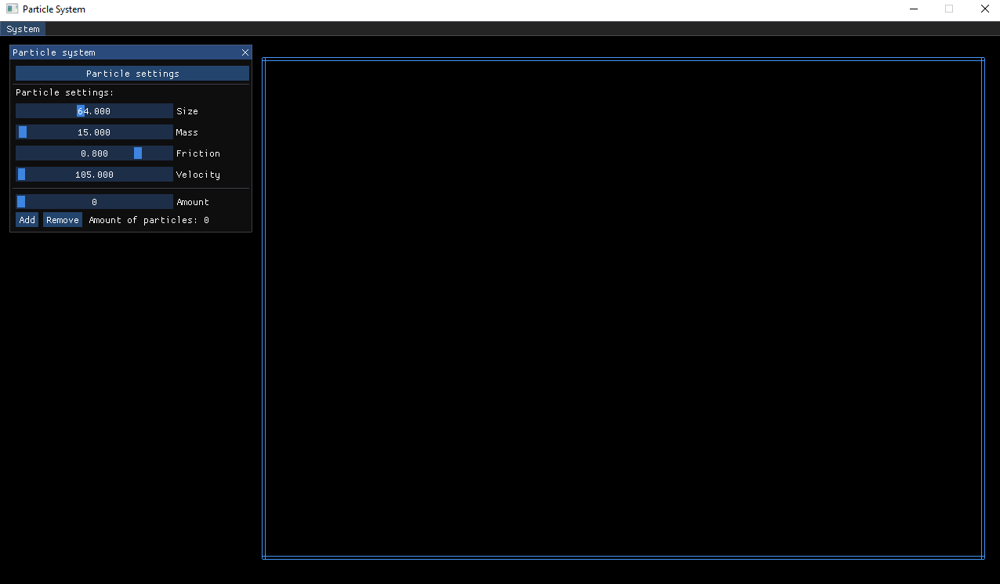
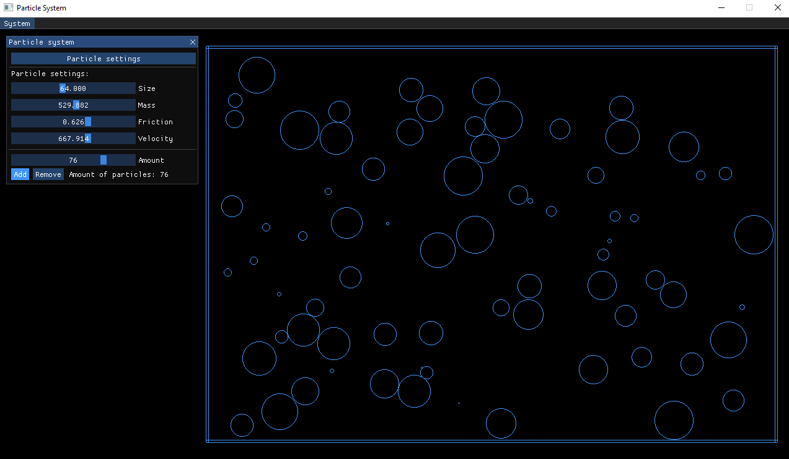
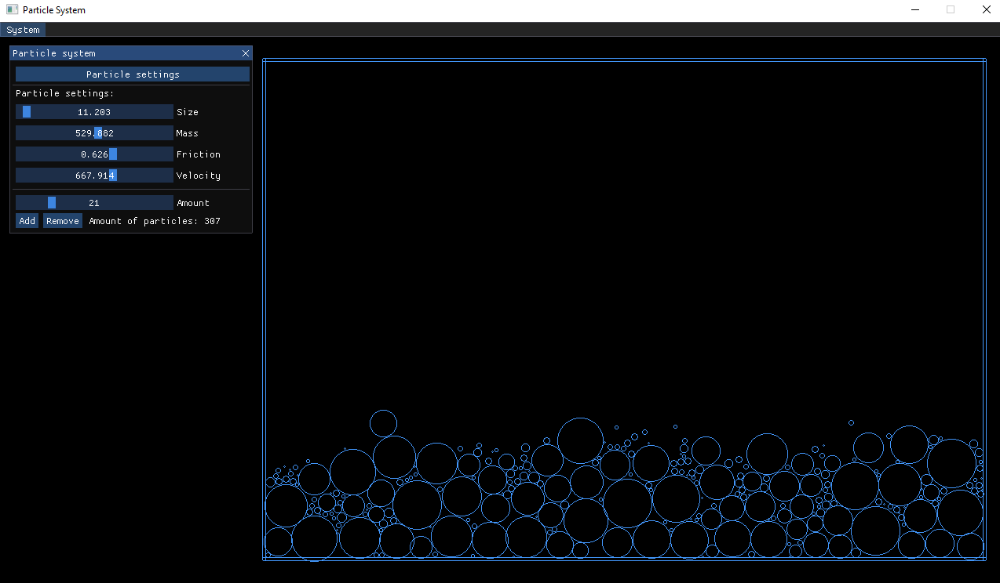

# Particle System
My Particle System has a user-interface to control basic physics attributes given to generated particles.

The project was made doing college in the subject 'Programming B' doing second year. 

### References

My Particle System uses a number of open source projects to work properly:
* [ImGui](https://github.com/ocornut/imgui) - User-Interface for option-interaction
* [SDL](https://www.libsdl.org/) - Graphical-User-Interface for the window and particles

### Information
This project does not include a projectfile, you will have to start a new project and include the libraries and files manually. 

### Illustration

